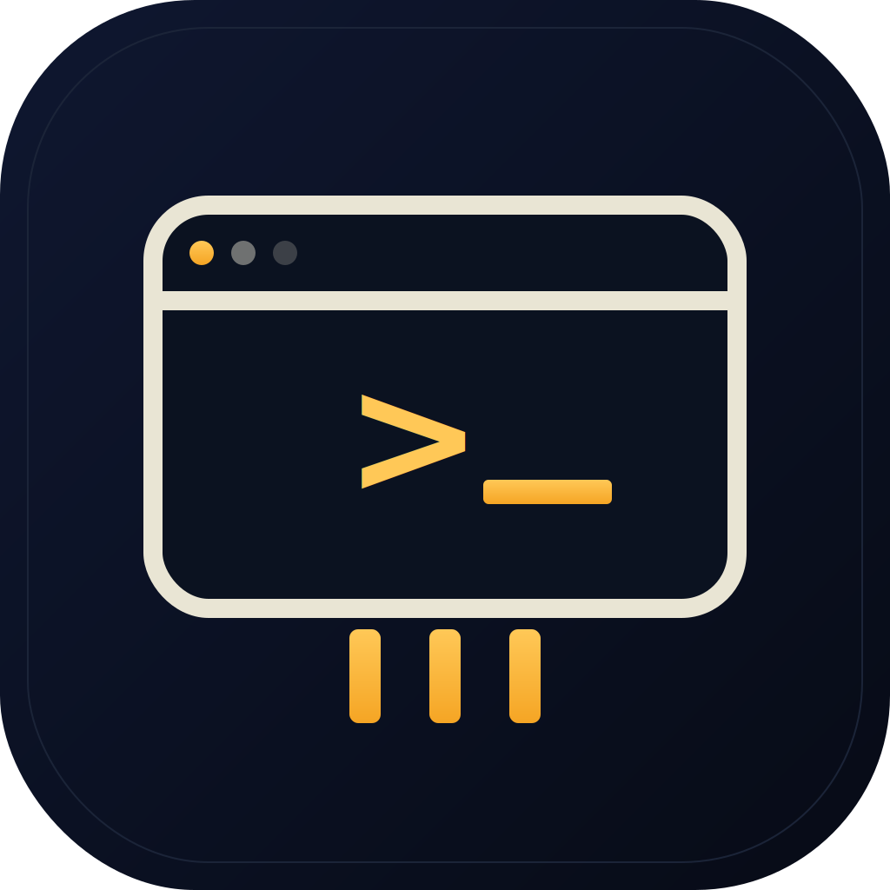

<p align="center">
  
</p>

<h1 align="center">guiport</h1>

<p align="center"><em>Playwright for desktop apps, built for coding agents.</em></p>

<p align="center">
  <a href="https://github.com/edihasaj/guiport/actions/workflows/ci.yml"></a>
  
  
  
</p>

---

A fast CLI/MCP control layer that lets agents like Claude, Codex, opencode, and Gemini inspect and operate desktop apps through structured UI data, then save successful flows as replayable tests.

## Status

MVP. macOS only. Accessibility tree first, screenshots as fallback.

## Why

Agents shouldn't drive desktop apps by guessing pixels. `guiport` exposes the desktop as structured data: app/window list, focused app/window, accessibility tree, element role/name/value/state/bounds/actions, screenshots only when needed, deterministic replay scripts after exploration.

## Install

macOS 13+. See [INSTALL.md](INSTALL.md) for full options + platform status.

```sh
# Homebrew (once tap is published)
brew tap edihasaj/guiport && brew install guiport

# Or install script
curl -fsSL https://raw.githubusercontent.com/edihasaj/guiport/main/scripts/install.sh | sh

# Or from source
swift build -c release && sudo cp .build/release/guiport /usr/local/bin/guiport
```

Linux + Windows are roadmap — see [INSTALL.md](INSTALL.md).

## Quick start

```sh
guiport doctor                                       # check permissions
guiport apps --json                                  # list running apps with windows
guiport observe --app "Safari"                       # focused window summary
guiport tree --app "Safari" --json                   # full accessibility tree
guiport find --app "Safari" 'button[name="Save"]'    # match selector
guiport click --app "Safari" 'button[name="Save"]'
guiport type "hello"
guiport screenshot --app "Safari" -o safari.png
guiport record smoke.yaml                            # WIP
guiport run smoke.yaml
guiport serve --mcp                                  # MCP server over stdio
```

## Selector syntax

```
role[attr=value][attr~=substring][index]
```

Examples:

```
button[name="Save"]
textfield[identifier="search"]
AXButton[name~="Open"][index=0]
```

Supported attributes: `role`, `name` (title), `value`, `identifier`, `description`, `text` (matches name or value), `index`.

## Permissions

`guiport` needs:

- **Accessibility** — required for AX tree + input events.
- **Screen Recording** — required for `screenshot` and screenshot-on-failure artifacts.

Run `guiport doctor` to check status and get System Settings deep links.

## Architecture

- Pure Swift, single binary.
- `GuiportCore` library: AX bridge, selector engine, input, screenshots, replay runner, MCP server.
- `guiport` CLI: thin wrapper using swift-argument-parser.

## Non-goals (MVP)

- No Windows/Linux yet.
- No vision-first automation.
- No autonomous Manus clone.
- No background/session-0 automation.

## License

MIT — see LICENSE.

## Author

[Edi Hasaj](https://edihasaj.com)
